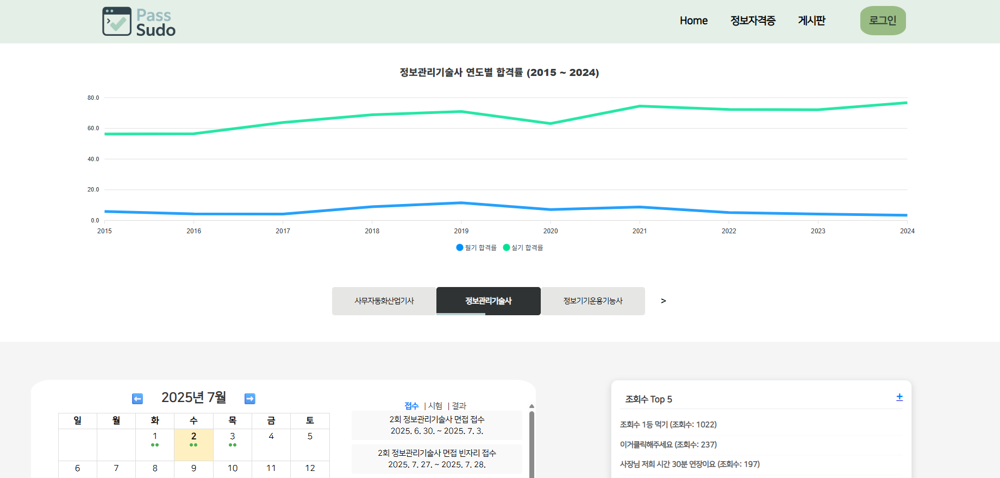
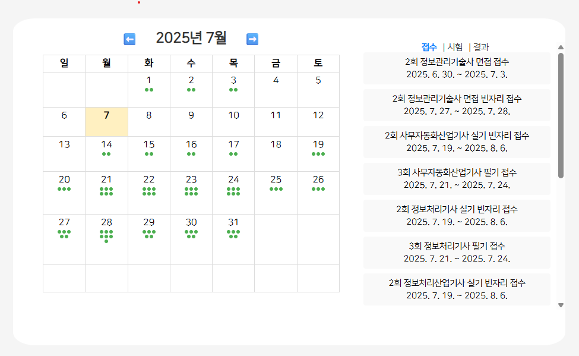
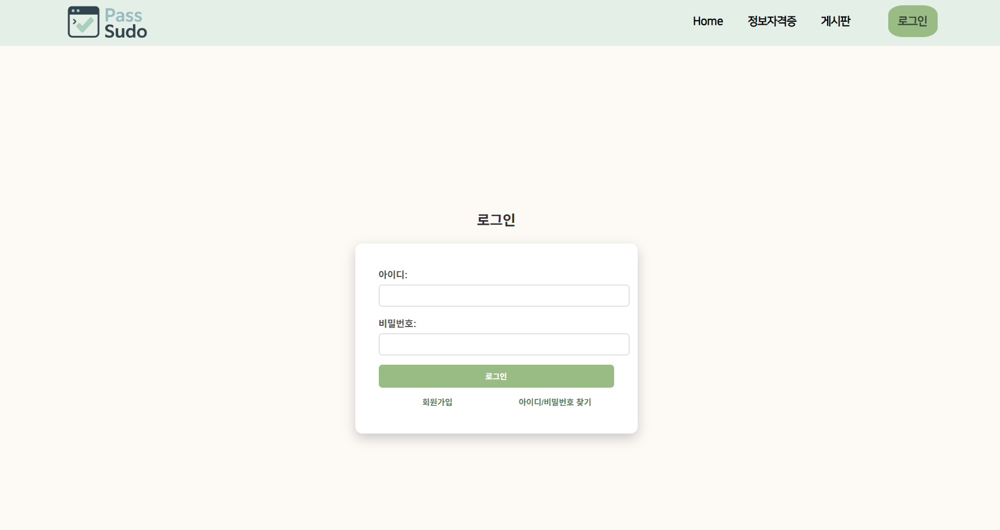
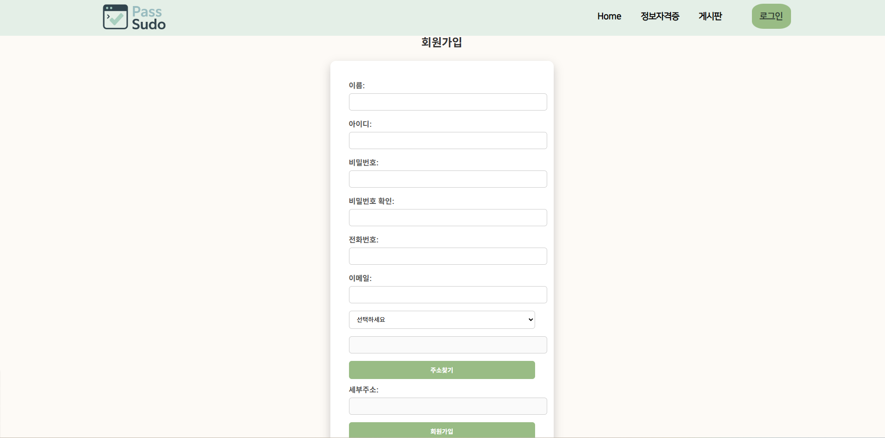
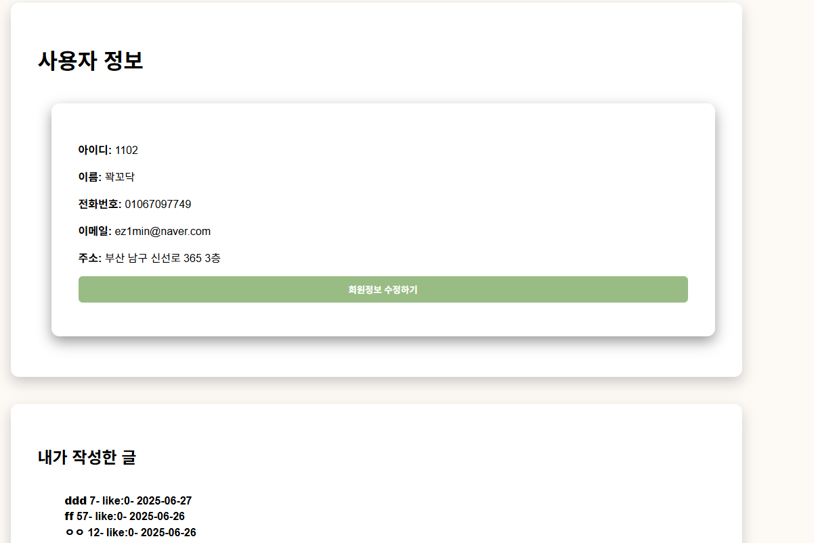
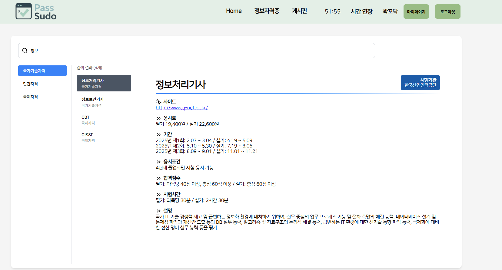
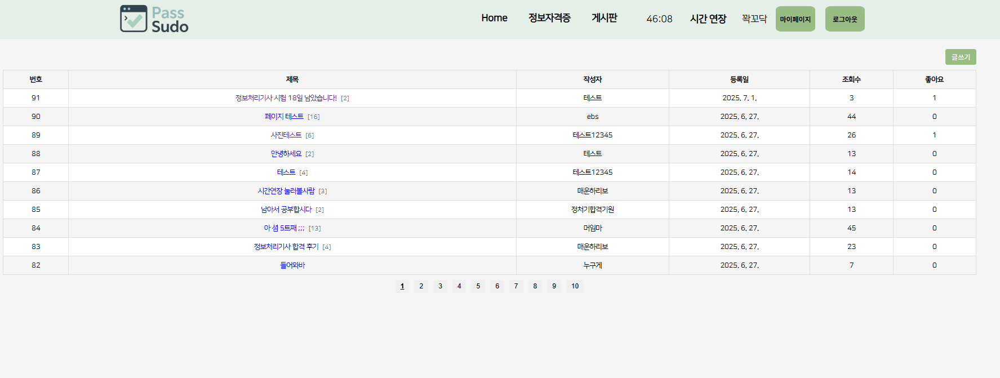
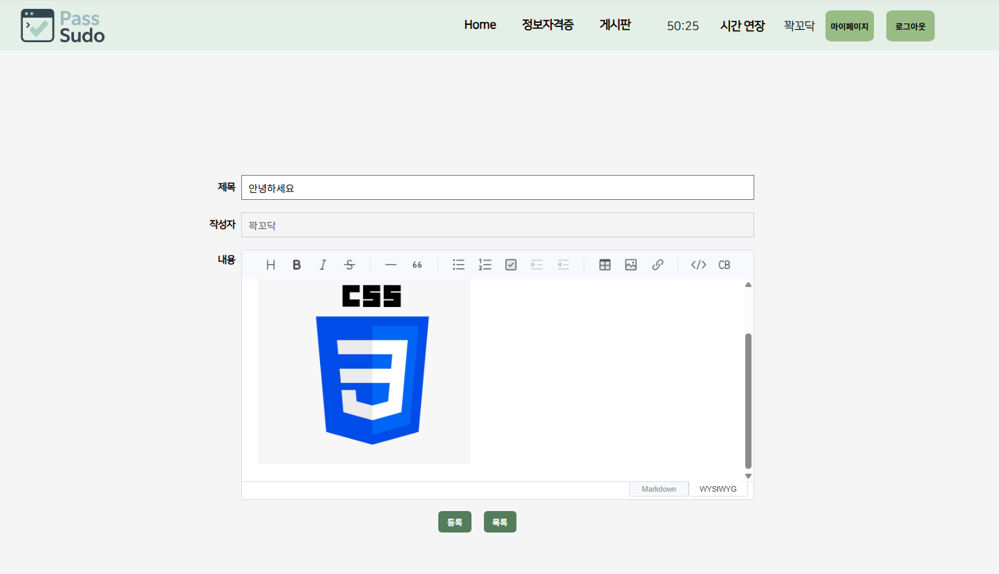
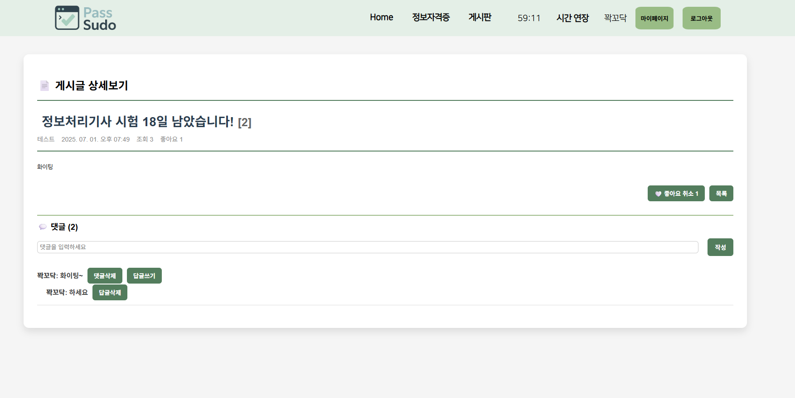

# 자격증 정보, 시험 및 정보공유 사이트

# 🎓 합격할 sudo!

[ 자격증 정보 제공 플랫폼 ]

> 사용자에게 국가기술자격,  민간자격,  국제자격 등 다양한 자격증 정보를 쉽게 검색하고 확인할 수 있는 웹 플랫폼입니다.
> 

---

## 📌 프로젝트 개요

- **제작 동기**

    프로젝트는 다양한 IT·전문 자격증 정보를 한눈에 조회할 수 있도록 하고, 시험 일정·관련 사이트 바로가기 기능을 통해 사용자가 효율적으로 학습 계획을 세울 수 있게 돕기 위해 기획
    
    자격증에 대한 정보가 흩어져 있어 찾기 불편했던 문제를 해결하고자 플랫폼을 제작
    
    누구나 손쉽게 자격증 종류, 응시 조건, 시험 일정 등을 확인할 수 있도록 구성
  
    또한 게시판과 댓글 기능을 통해 회원 간 스터디 자료를 공유하고 소통할 수 있는 커뮤니티 환경을 제공
    
- **주요 기능**
    - 자격증 분류별 정보 제공 (국가기술자격 / 민간자격 / 국제자격)
    - 자격증명으로 검색 기능
    - 자격증 상세 정보 제공 (시행기관, 응시료, 응시조건 등)
    - 자격증 정보 공유 게시판
- **사용 대상**
    - 자격증 취득을 준비하는 학생, 직장인
    - 다양한 자격정보를 한눈에 비교하고 싶은 사용자

---

## 📅 제작 기간

- 2025.06.16 ~ 2025.06.25 (10일)

1. 주제 선정 및 UI 기획, ERD 설계, 데이터분석
2. 백엔드 API 설계 및 초기 구현
3. 프론트엔드 UI 개발 및 DB 연동
4. 페이지별 기능 구현
   - 회원가입／로그인／로그아웃
   - 게시글 작성／수정／삭제／조회
   - 댓글 작성／삭제／답글
   - 페이징
5. 최종 마무리 및 보고서 정리

---

## 👥 팀원 소개

| 이름 | 담당 업무 |
| --- | --- |
| 박세찬 (조장) | DB 관리, 로그인, 캘린더, 게시판 구현 |
| 이성훈 (팀원1) | 로그인 기능, 게시판 일부 구현 |
| 이지민 (팀원2) | 메인페이지, 게시판 디자인 |
| 박혜빈 (팀원3) | 자격증 정보 페이지, 게시판 일부 구현 |

---

## 💻 기술 스택

- **Frontend**: React, Vite, JavaScript, CSS
- **Backend**: Spring Boot (Java)
- **Database**: Oracle
- **Deployment**: Docker, GitHub
- **기타**: ApexCharts (차트 시각화), Axios, Lucide-react

---

## 🚀 주요 기능

- 🔍 **카테고리별 자격증 분류**
    - 국가기술자격 / 민간자격(국가공인, 비공인) / 국제자격
- 🧾 **자격증 상세 정보 제공**
    - 응시 조건, 시험일정, 합격 기준, 시행기관 등
- 🔎 **검색 기능**
    - 키워드로 자격증 이름 또는 설명 검색 가능
- 📊 **통계 시각화**
    - 자격증 합격률, 응시자 수 추이 등 차트로 시각화
- ✏️ **정보 공유 게시판**
    - 사용자 간 자격증 관련 정보, 시험 후기, 공부 자료 등을 자유롭게 공유할 수 있는 공간 

---

# **🏭 홈페이지 구조**

## 📸 화면

- 메인 페이지

- 시험일정

- 로그인 화면

- 회원가입 화면

- 마이페이지
  

- 자격증 검색 페이지
    

    

    
- 자유 게시판

---
